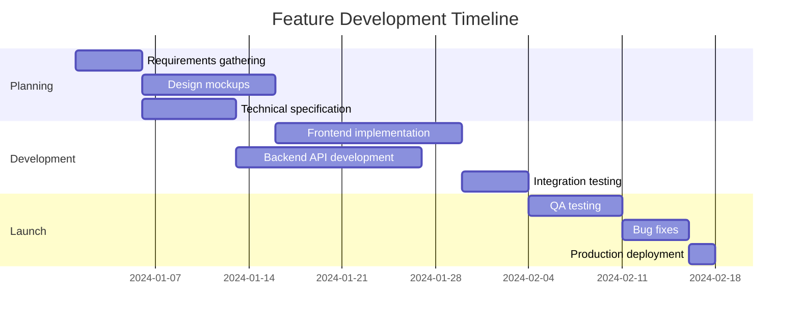

Learn from successful teams and implement proven strategies to get the most out of ACME Company. These practices are based on real-world usage patterns and team feedback.

## Team Organization

### Project structure strategy

Organize your workspace for maximum clarity and efficiency:

<CodeGroup tabs="Team Structure,Project Hierarchy,Naming Conventions">
```yaml
# Recommended team organization
Organization:
  Departments:
    - Engineering:
        - Frontend Team
        - Backend Team  
        - DevOps Team
        - QA Team
    - Product:
        - Product Managers
        - UX Designers
        - Product Analysts
    - Marketing:
        - Content Team
        - Growth Team
        - Brand Team
    - Operations:
        - Customer Success
        - Sales Team
        - Support Team
```

```yaml
# Project hierarchy best practices
Workspace:
  Active Projects:
    - Product Development:
        - "Q1 Feature Release"
        - "Mobile App v2.0"
        - "API Platform"
    - Marketing Initiatives:
        - "Brand Refresh 2024"
        - "Content Marketing Q1"
        - "Lead Gen Campaign"
    - Operations:
        - "Customer Onboarding"
        - "Support Process Optimization"
        
  Templates:
    - "Feature Development Template"
    - "Marketing Campaign Template"  
    - "Bug Fix Template"
    
  Archived:
    - Completed projects (auto-archived after 90 days)
```

```yaml
# Naming conventions that work
Projects:
  format: "[Department] [Initiative] [Year/Quarter]"
  examples:
    - "ENG Mobile App Redesign Q1"
    - "MKT Brand Campaign 2024"  
    - "OPS Onboarding Improvement Q2"

Tasks:
  format: "[Priority] [Action] [Subject]"
  examples:
    - "HIGH Fix login bug on mobile"
    - "MED Create API documentation"
    - "LOW Update team photos"

Labels:
  categories:
    - Priority: "urgent", "high", "medium", "low"
    - Type: "feature", "bug", "improvement", "research"  
    - Department: "eng", "product", "marketing", "ops"
    - Status: "blocked", "waiting", "in-review"
```
</CodeGroup>

### Role and permission strategy

**Recommended role distribution**:

| Team Size | Owners | Admins | Members | Viewers |
|-----------|--------|--------|---------|---------|
| **2-10** | 1 | 1-2 | Everyone else | External only |
| **11-50** | 1-2 | 3-5 | Team leads + ICs | Contractors |
| **50+** | 2-3 | 5-10 | Department leads | Stakeholders |

<Callout kind="tip">
  **The 80/20 rule**: 80% of your team should be Members with standard access. Reserve Admin roles for people who actively manage workspace settings.
</Callout>

### Cross-functional collaboration

**Establish clear handoff processes**:

<ExpandableGroup>
<Expandable title="Design to Engineering Handoff" default-open="true">

**Before handoff checklist**:
- [ ] Design specs finalized and approved
- [ ] Assets exported in required formats
- [ ] Interactive prototypes shared
- [ ] Edge cases and error states documented
- [ ] Accessibility requirements specified

**Handoff process**:
1. **Designer creates task** with all specifications
2. **Engineering lead reviews** feasibility and estimates effort
3. **Product manager approves** scope and timeline  
4. **Task assigned to developer** with clear acceptance criteria
5. **Regular check-ins** during development for clarifications

**Tools integration**:
```javascript
// Auto-create engineering tasks from design completion
{
  "trigger": "design_approved",
  "action": {
    "create_task": {
      "project": "engineering_backlog",
      "template": "design_implementation",
      "assign_to": "frontend_lead",
      "inherit_details": true
    }
  }
}
```

</Expandable>

<Expandable title="Development to QA Handoff" default-open="false">

**Development completion criteria**:
- [ ] All acceptance criteria met
- [ ] Code reviewed and approved
- [ ] Unit tests written and passing
- [ ] Documentation updated
- [ ] Deployed to staging environment

**QA process**:
1. **Automated testing** runs on staging deployment
2. **Manual testing** covers user scenarios and edge cases
3. **Bug reports** link back to original development task
4. **Approval or feedback** provided within agreed SLA
5. **Production deployment** coordinated between teams

</Expandable>

<Expandable title="Product to Marketing Handoff" default-open="false">

**Feature launch preparation**:
- [ ] Feature functionality documented
- [ ] Target audience and use cases defined
- [ ] Key benefits and differentiators identified
- [ ] Screenshots and demo materials prepared
- [ ] Pricing and packaging decisions finalized

**Marketing campaign workflow**:
1. **Product team creates** launch brief and timeline
2. **Marketing develops** positioning and messaging
3. **Content creation** coordinated across channels
4. **Cross-team review** ensures technical accuracy
5. **Launch execution** with coordinated communications

</Expandable>
</ExpandableGroup>

## Workflow Optimization

### Task management best practices

**Write effective task descriptions**:

<CodeGroup tabs="Good Examples,Bad Examples,Templates">
```markdown
# GOOD: Clear, actionable task descriptions

## Task: Implement user profile image upload

**Objective**: Allow users to upload and display custom profile pictures

**Acceptance Criteria**:
- [ ] Users can click profile area to upload image
- [ ] Supports JPEG, PNG, GIF formats up to 5MB
- [ ] Automatically resizes to 200x200px
- [ ] Updates across all user interface locations
- [ ] Includes loading state and error handling

**Technical Notes**:
- Use existing file upload service API
- Add image validation on frontend and backend
- Update user model to include profile_image_url field

**Resources**:
- Design mockups: [link]
- API documentation: [link]
- Similar implementation in admin panel: [link]
```

```markdown
# BAD: Vague, unclear descriptions

## Task: Fix the thing

**Description**: The profile thing is broken and needs to be fixed

**Notes**: Sarah said it's not working right

---

## Task: Update the website  

**Description**: Make the website better

**Todo**: 
- Fix stuff
- Make it faster
- Add new things
```

```markdown
# TEMPLATES: Reusable task formats

## Bug Report Template
**Summary**: [One line description]
**Steps to Reproduce**: 
1. [Step one]
2. [Step two]
**Expected Result**: [What should happen]
**Actual Result**: [What actually happens] 
**Environment**: [Browser, device, etc.]

## Feature Request Template
**User Story**: As a [user type], I want [goal] so that [benefit]
**Acceptance Criteria**: [Specific requirements]
**Priority**: [High/Medium/Low with justification]
**Effort Estimate**: [T-shirt size or hours]
```
</CodeGroup>

**Task sizing and estimation**:

| Size | Description | Time Range | Examples |
|------|-------------|------------|----------|
| **XS** | Simple, obvious changes | < 2 hours | Fix typo, update copy, small CSS change |
| **S** | Straightforward implementation | 2-8 hours | Add form field, simple API integration |
| **M** | Moderate complexity | 1-3 days | New feature component, complex form |
| **L** | Complex implementation | 3-7 days | Major feature, integration with multiple systems |
| **XL** | Large initiative | 1-2 weeks | Complete new workflow, major refactoring |

<Callout kind="warning">
  **Break down XL tasks**: Any task larger than 2 weeks should be broken into smaller, manageable pieces. This improves tracking and reduces risk.
</Callout>

### Deadline and timeline management

**Setting realistic deadlines**:

1. **Add buffer time**: Include 20-30% buffer for unexpected issues
2. **Consider dependencies**: Map out prerequisite tasks and potential blockers
3. **Account for reviews**: Include time for stakeholder feedback and revisions
4. **Plan for testing**: Allocate adequate time for QA and bug fixes
5. **Communicate early**: Alert team if deadlines look at risk

**Timeline visualization**:



## Communication Best Practices

### Effective commenting

**Comment guidelines that improve collaboration**:

<ExpandableGroup>
<Expandable title="Constructive Feedback" default-open="true">

**Use specific, actionable language**:

✅ **Good comments**:
```text
The login form validation looks good! Two suggestions:
1. Could we add an email format validator before submission?
2. The error message for weak passwords should include requirements

These changes would reduce support tickets and improve UX.
```

❌ **Poor comments**:
```text
This doesn't look right. Please fix.
```

**Feedback framework** (SBI model):
- **Situation**: Describe the context
- **Behavior**: Explain what you observed  
- **Impact**: Share the effect or outcome

</Expandable>

<Expandable title="Status Updates" default-open="false">

**Regular progress updates**:
```text
📊 Weekly Progress Update - Mobile App Feature

✅ Completed this week:
- User authentication flow implemented
- Profile management UI completed
- Initial API integration working

🔄 In progress:
- Push notification setup (70% complete)
- App store submission preparation

⚠️ Blockers/Issues:
- Waiting for Apple Developer account approval
- Need design approval on notification templates

🎯 Next week goals:
- Complete notification system
- Submit to app stores for review
- Begin user acceptance testing

cc: @project-team @stakeholders
```

</Expandable>

<Expandable title="Decision Documentation" default-open="false">

**Document important decisions**:
```text
🔍 Architecture Decision: Database Choice

**Context**: Need to choose database for user analytics feature

**Options considered**:
1. PostgreSQL (current database)
   - Pros: Consistent with existing stack, good performance
   - Cons: May not scale for analytics workload

2. ClickHouse (specialized analytics DB)  
   - Pros: Optimized for analytics queries, better performance
   - Cons: Additional infrastructure, team learning curve

**Decision**: Going with ClickHouse
- Performance requirements justify the complexity
- Team has capacity to learn new technology
- Long-term benefits outweigh short-term costs

**Action items**:
- @devops: Set up ClickHouse instance
- @backend: Create migration scripts  
- @team: Schedule training session

Decision date: 2024-01-15
Review date: 2024-03-15
```

</Expandable>
</ExpandableGroup>

### Notification management

**Reduce notification fatigue**:

**Smart notification settings**:
```javascript
// Recommended notification configuration
{
  "immediate_notifications": [
    "tasks_assigned_to_me",
    "urgent_mentions", 
    "project_blockers"
  ],
  "daily_digest": [
    "team_progress_updates",
    "deadline_reminders", 
    "new_team_announcements"
  ],
  "weekly_digest": [
    "project_summaries",
    "completed_milestones",
    "upcoming_deadlines"
  ],
  "never_notify": [
    "task_status_changes_not_involving_me",
    "low_priority_comments",
    "automated_system_updates"
  ]
}
```

**Communication escalation ladder**:
1. **Comment on task** - For normal project updates
2. **@mention specific person** - When you need someone's attention  
3. **Slack/Teams message** - For urgent issues during work hours
4. **Phone call** - For critical blockers or emergencies only

## Performance Monitoring

### Key metrics to track

**Team productivity metrics**:

<CodeGroup tabs="Velocity Tracking,Quality Metrics,Collaboration Health">
```javascript
// Velocity and throughput metrics
{
  "sprint_metrics": {
    "planned_vs_completed": {
      "target": "> 85%",
      "current": "89%"
    },
    "cycle_time": {
      "target": "< 5 days", 
      "current": "4.2 days"
    },
    "throughput": {
      "tasks_per_week": 23,
      "story_points_per_sprint": 84
    }
  },
  "trend_analysis": {
    "velocity_trend": "stable",
    "quality_trend": "improving", 
    "team_satisfaction": "high"
  }
}
```

```javascript
// Quality and reliability metrics  
{
  "quality_metrics": {
    "bug_rate": {
      "bugs_per_feature": 0.3,
      "post_release_bugs": 2,
      "regression_rate": "< 5%"
    },
    "review_effectiveness": {
      "review_coverage": "98%",
      "avg_review_time": "6 hours",
      "issues_caught_in_review": 15
    }
  }
}
```

```javascript
// Team collaboration health
{
  "collaboration_metrics": {
    "response_times": {
      "avg_comment_response": "2.1 hours",
      "code_review_response": "4.3 hours"
    },
    "knowledge_sharing": {
      "cross_team_collaboration": "high",
      "documentation_coverage": "87%"
    },
    "team_engagement": {
      "active_contributors": "100%",
      "meeting_participation": "94%"
    }
  }
}
```
</CodeGroup>

### Continuous improvement

**Regular retrospectives**:

**Monthly team retrospectives** using the Start/Stop/Continue format:

<ExpandableGroup>
<Expandable title="January Retrospective Example" default-open="false">

**What should we START doing?**
- Daily standup meetings for better sync
- Using task templates for consistency  
- Peer code reviews before QA handoff

**What should we STOP doing?**
- Having meetings without clear agendas
- Working on tasks without clear acceptance criteria
- Skipping documentation updates

**What should we CONTINUE doing?**
- Weekly team demos are valuable
- Slack integration keeps everyone informed
- Cross-training is improving team flexibility

**Action items**:
- [ ] @team-lead: Schedule daily standups starting next week
- [ ] @product: Create task templates for common work types
- [ ] @everyone: Commit to documentation-first approach

</Expandable>
</ExpandableGroup>

**Process optimization cycle**:

1. **Measure**: Track key metrics over 2-4 week periods
2. **Analyze**: Identify bottlenecks and improvement opportunities  
3. **Experiment**: Try small process changes with specific goals
4. **Review**: Assess impact and decide whether to adopt permanently
5. **Iterate**: Continuous small improvements over time

## Scaling Your Usage

### Growing team considerations

**Onboarding new team members**:

<Callout kind="success">
  **Pro tip**: Create a "New Team Member" project template with standard onboarding tasks. This ensures consistent experience and nothing gets missed.
</Callout>

**New member onboarding checklist**:
- [ ] Account created with appropriate role
- [ ] Added to relevant projects and teams
- [ ] Completed platform training (internal or Documentation.AI resources)
- [ ] Integrated with personal workflow tools (calendar, notifications)
- [ ] Paired with buddy/mentor for first two weeks
- [ ] First real task assigned with support available

### Enterprise considerations

**Advanced features for larger teams**:

- **Single Sign-On (SSO)**: Streamline access management
- **Advanced reporting**: Track metrics across departments  
- **API integrations**: Connect with enterprise tools
- **Custom workflows**: Match complex organizational processes
- **Audit logs**: Meet compliance and security requirements
- **Dedicated support**: Priority assistance for critical issues

## Common Pitfalls to Avoid

### Anti-patterns that hurt productivity

<ExpandableGroup>
<Expandable title="Over-organizing" default-open="true">

**The problem**: Creating too many projects, categories, and tags

**What it looks like**:
- 20+ active projects for a 10-person team
- Complex tagging systems nobody uses consistently  
- Multiple projects for the same initiative
- Endless reorganization without clear benefit

**Better approach**:
- Start simple and add complexity only when needed
- Focus on 3-5 active projects per team at most
- Use consistent naming conventions
- Regular cleanup of unused categories

</Expandable>

<Expandable title="Notification overload" default-open="false">

**The problem**: Too many notifications leading to notification blindness

**What it looks like**:
- Team members ignoring all notifications
- Important updates getting lost in the noise
- People checking the app less frequently
- Decreased responsiveness to urgent issues

**Better approach**:
- Configure notifications thoughtfully for each role
- Use @mentions sparingly and purposefully
- Set up digest emails instead of real-time notifications
- Regular review and adjustment of notification preferences

</Expandable>

<Expandable title="Status update theater" default-open="false">

**The problem**: Updating status without meaningful progress

**What it looks like**:
- Tasks moved between stages without real changes
- Comments like "still working on this" without details
- Artificial progress to meet reporting requirements
- Lack of transparency about actual blockers

**Better approach**:
- Focus on outcome-based status updates
- Include specific progress and next steps
- Be honest about blockers and challenges
- Use automation to reduce manual status management

</Expandable>
</ExpandableGroup>

## Success Stories

### Real team improvements

**Case study: Engineering team cycle time**

> "After implementing task templates and clearer acceptance criteria, our average cycle time dropped from 8 days to 4 days. More importantly, our bug rate decreased by 40% because requirements were clearer upfront."
> 
> — Sarah Chen, Engineering Manager at TechCorp

**Key changes implemented**:
- Standardized task descriptions with templates
- Required acceptance criteria before development starts
- Automated status updates from GitHub integration
- Weekly retrospectives to identify process improvements

**Case study: Marketing campaign coordination**

> "Coordinating product launches across content, social, email, and PR used to be chaos. Now we have visibility into every deliverable and deadline. Our last launch had zero missed deadlines."
>
> — Mike Rodriguez, Marketing Director at GrowthCo

**Key changes implemented**:
- Created campaign project template with all standard deliverables
- Set up automated reminders for review cycles
- Integrated with content calendar and social media tools
- Established clear handoff processes between teams

---

## Next Steps

Ready to implement these best practices?

- **[Start with quick wins](../components/components-overview)** - Pick 2-3 easy improvements to implement first
- **[Explore advanced features](../api-reference/getting-started)** - Leverage integrations and automation
- **[Get team training](https://acme.com/training)** - Ensure everyone knows how to use advanced features
- **[Join our community](https://community.acme.com)** - Learn from other teams and share your own successes
